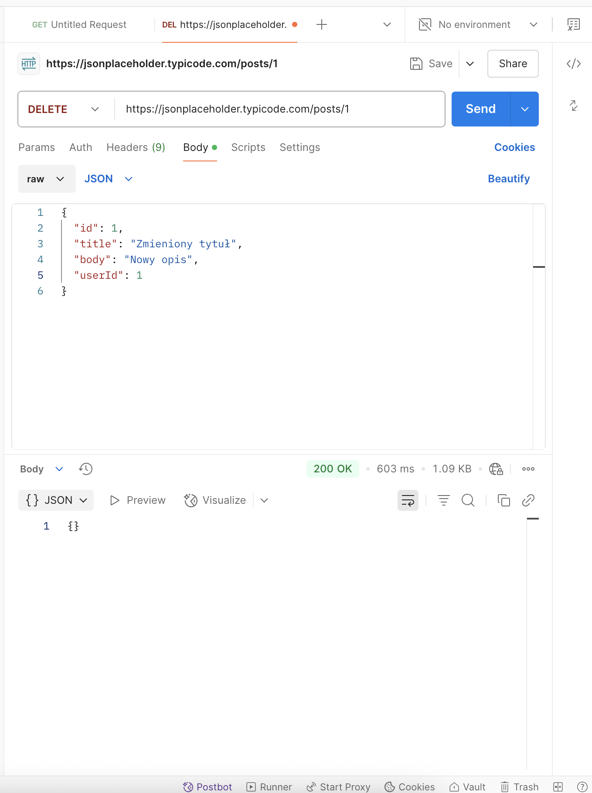

# API Test Log – JSONPlaceholder

Testy wykonane manualnie za pomocą Postmana na publicznym API: https://jsonplaceholder.typicode.com

---

## Test 1 – GET /posts

**Request:**  
GET https://jsonplaceholder.typicode.com/posts

**Oczekiwany rezultat:**  
- Status: 200 OK  
- Response: lista 100 postów (każdy z userId, id, title, body)

**Wynik:**  
 Sukces – otrzymano 100 postów  


---

## Test 2 – GET /users/1

**Request:**  
GET https://jsonplaceholder.typicode.com/users/1

**Oczekiwany rezultat:**  
- Status: 200 OK  
- Response: dane użytkownika z id = 1

**Wynik:**  
 Sukces – poprawne dane użytkownika  


---

## Test 3 – POST /posts

**Request:**  
POST https://jsonplaceholder.typicode.com/posts  
**Body:**
```json
{
  "title": "Bug w module logowania",
  "body": "Opis błędu...",
  "userId": 1
}
```

**Oczekiwany rezultat:**  
- Status: 201 Created  
- Response: zawiera `id` oraz dane wysłane

**Wynik:**  
Sukces – otrzymano nowy post z id  


---

## Test 4 – PUT /posts/1

**Request:**  
PUT https://jsonplaceholder.typicode.com/posts/1  
**Body:**
```json
{
  "id": 1,
  "title": "Zmieniony tytuł",
  "body": "Nowy opis",
  "userId": 1
}
```

**Oczekiwany rezultat:**  
- Status: 200 OK  
- Response: to, co zostało wysłane

**Wynik:**  
Sukces – odpowiedź zgodna z requestem  


---

## Test 5 – DELETE /posts/1

**Request:**  
DELETE https://jsonplaceholder.typicode.com/posts/1

**Oczekiwany rezultat:**  
- Status: 200 OK lub 204 No Content  
- Response: brak błędów

**Wynik:**  
Sukces – status poprawny  


---