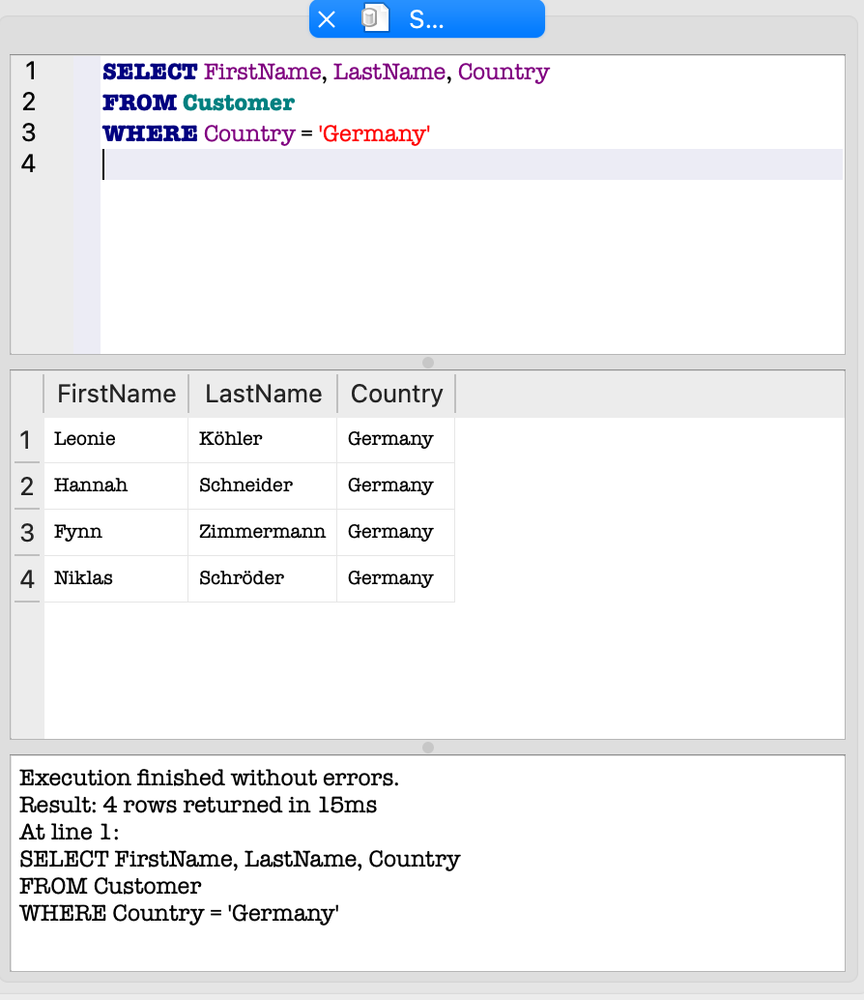
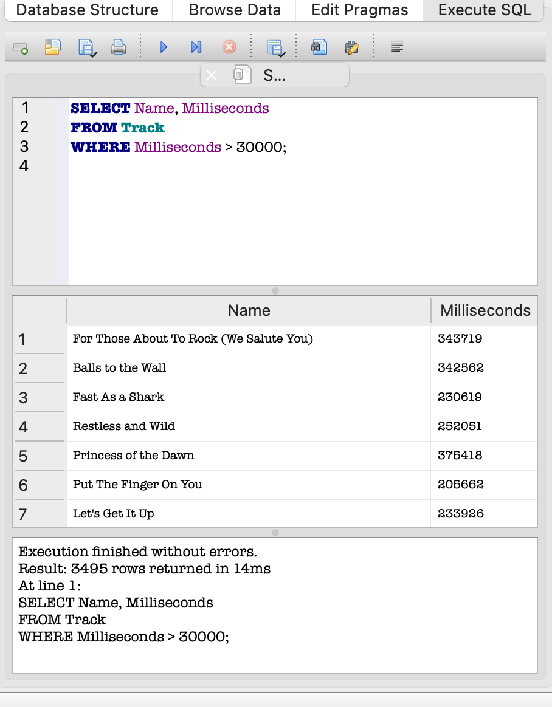

## SQL - zapytania
```sql

Zapytanie 1 - Klienci z Niemiec

SELECT FirstName, LastName, Country
From customers
WHERE Country = 'Germany'

Opis
- Zapytanie filtruje klientów po kraju 



---

Zapytanie 2 - Utwowy dłuższe niż 5 minut

SELECT Name, Milliseconds
FROM tracks
WHERE Miliseconds > 300000;add

Opis
- Weryfikacja, czy system przechowuje czas trwania utworu poprawnie i pozwala go używać jako kryterium filtrowania (edge case: długi utwór).


