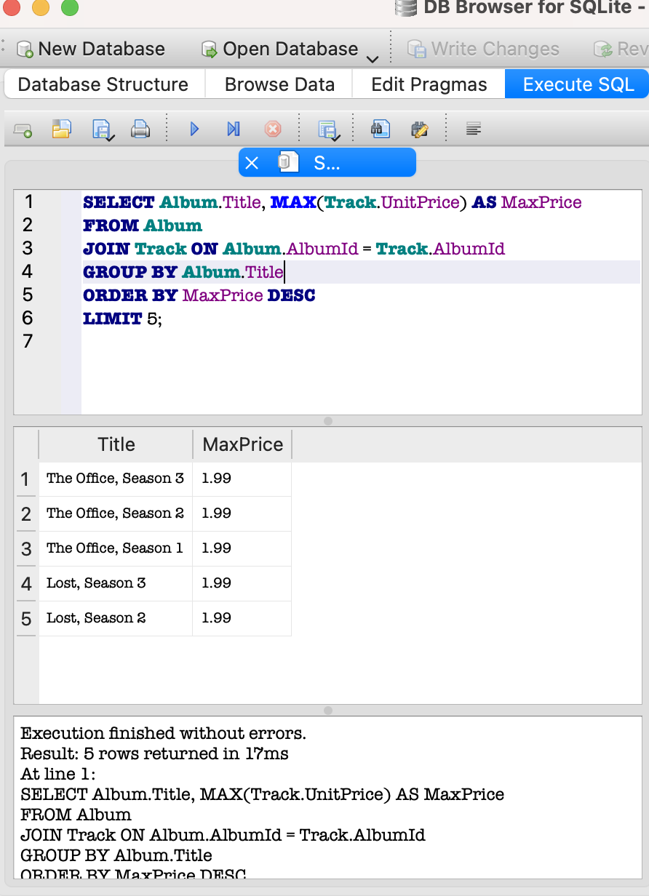

## SQL – zapytania

### Zapytanie 1 – Klienci z Niemiec

```sql
SELECT FirstName, LastName, Country
FROM Customer
WHERE Country = 'Germany';
```

Opis

- Zapytanie filtruje klientów po kraju 


## Zapytanie 2 - Utwowy dłuższe niż 5 minut

```sql
SELECT Name, Milliseconds
FROM tracks
WHERE Miliseconds > 300000;add
```
Opis

- Weryfikacja, czy system przechowuje czas trwania utworu poprawnie i pozwala go używać jako kryterium filtrowania (edge case: długi utwór).


## Zapytanie 3 - 5 Najdroższych albumów 

```sql
SELECT Album.Title, MAX(Track.UnitPrice) AS MaxPrice
FROM Album
JOIN Track ON Album.AlbumId = Track.AlbumId
GROUP BY Album.Titlequery
ORDER BY MaxPrice DESC
LIMIT 5;
```
Opis

- test agregacji + joinów – czy system potrafi znaleźć max wartości po grupie.




